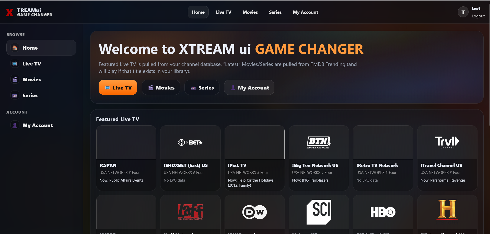
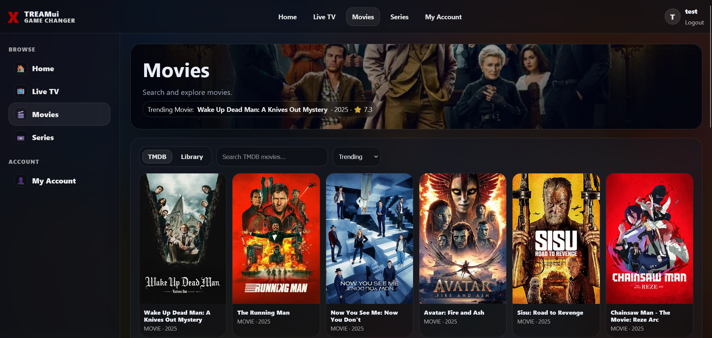
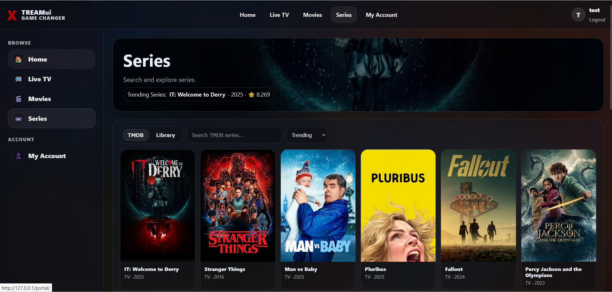
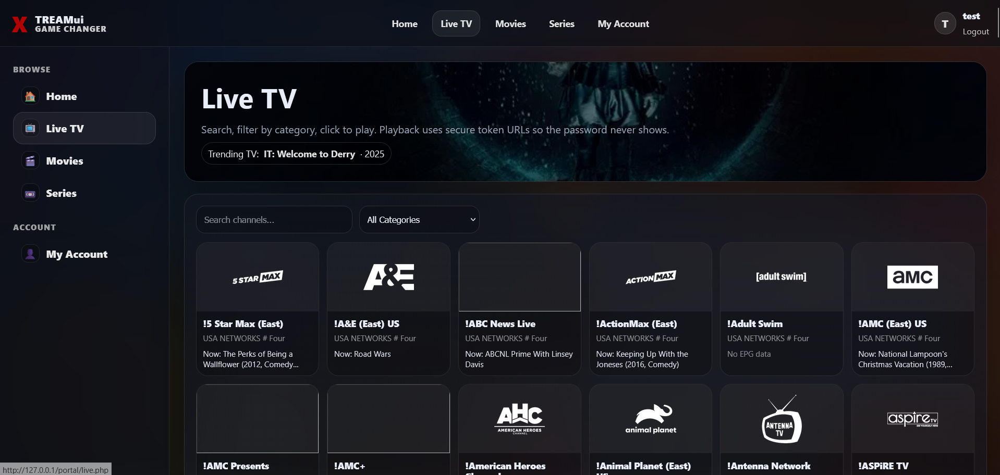
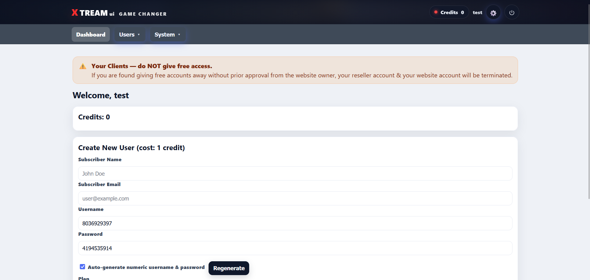

[](https://cash.app/$tysonworlds)

# Simple IPTV Admin Panel (PHP 7.4–8.x) — Gamechanger Edition

Pure PHP + MySQL IPTV panel + companion Android app. No frameworks. No Composer. Shared-hosting friendly.

**Xtream-style Player API is working/fixed** and the Android client consumes it cleanly.

---

## Android App Download (Released)

The Android TV / Android phone app is **released for download**.

While the APK is public, the **full app source is private**.

---

## 🚀 Gamechanger: Ordered Multi‑M3U Imports (Server-Side)

This panel supports **multi M3U upload** with a **drag & drop “import order” list** — and that order is **persisted everywhere**:

- Panel category + channel lists
- User M3U downloads (`get.php`)
- Xtream-style API output (`player_api.php`)

So if an admin imports files in the order:

1) Sports.m3u  
2) Movies.m3u  
3) Kids.m3u  

…then the panel + exported playlists return **Sports → Movies → Kids**, matching that exact order (server-side).

> Note: Some IPTV apps still sort locally (A→Z) no matter what. The server output is ordered, but the client may override it.

---

# ✅ Major Systems & Features (Everything Included)

## 1) Admin + Reseller Panels

### Admin Area (`/admin`)
- Admin login/logout
- Dashboard stats (channels, health stats, users/resellers, recent checks)
- Full content management (categories/channels, imports, EPG, telemetry, bans, backups)
- Subscription + billing management

### Reseller Area (`/reseller`)
- Reseller login/logout
- Add/edit users
- Reset credentials (generate numeric username/password)
- Credits badge visible in topbar (green if > 0, red if 0)
- Hardened permissions (resellers can’t do bans/override billing)

### Admin/Reseller Dropdown → Change Password
Topbar dropdown allows the logged-in user to change their own password securely (current password required).

---

## 2) Content Management (Channels + Categories)

### Category Manager + Channel Manager
Dedicated management UI that lets admins:
- Create/rename/delete categories (shows channel counts)
- Manage channels inside a selected category
- Keeps `channels.category_id` and `channels.group_title` aligned for clean `group-title` output

### Cascade Delete Categories
Deleting a category also deletes all channels inside it (safe cascade delete behavior).

> “Uncategorized” (or protected base category) is protected from deletion.

---

## 3) M3U Import System (Single + Multi)

### Multi M3U Upload + Drag & Drop Order
- Upload multiple M3U files at once
- Drag & drop to arrange import order before importing
- Import order persists across panel + exports

### Persistent Ordering Everywhere
The DB tracks ordering:
- `categories.sort_order`
- `channels.sort_order`

After import:
- Categories appear in the same order as imported files
- Channels appear in consistent order inside each category

### Import Upsert + Re-Order
To support re-importing without duplicates:
- Channels are upserted (matched by stream URL) when possible
- Re-importing can update ordering and metadata instead of creating duplicates

---

## 4) EPG System (Upgraded)

### XMLTV endpoint returns real EPG
`xmltv.php` outputs a real XMLTV feed based on imported guide data (not an empty `<tv>`).

### EPG Extract / Filter (Admin → EPG)
- Upload XMLTV (`.xml` or `.gz`)
- Auto-detect “locations” using id/display-name matching
- Select locations → generates a new filtered XMLTV download

### Upload XMLTV as Source (Admin → EPG)
- Upload 1 or 2 XMLTV files (`.xml` or `.gz`)
- If 2 files: combined into one XMLTV on the server
- Creates/updates a “local upload” source in DB and runs importer automatically

### Auto-replace EPG on import
Import from URL or uploaded XMLTV replaces previous guide data:
- No duplicates
- No stale programmes
- Uploading again updates the existing “local upload” source; old files are cleaned up

---

## 5) Stream Limits + Device Lock (Channel-Switch Safe)

### Max Streams + Max Devices Enforcement
- Channel switching on the same device does NOT stack sessions
- Max Streams behaves like true concurrent sessions/devices
- Max Devices enforced separately when Device Lock is enabled

### Near Real-Time Active Stream Tracking
- Sessions stay “alive” only while actively streaming (updates `last_seen`)
- Slots free quickly after stream stops
- Prevents false “limit reached” during fast channel flips

### `strict_device_id` (Config)
If enabled, requires client to send a stable `device_id` (querystring or `X-Device-ID` header). Recommended for the Android app.

---

## 6) Abuse Controls (Bans, Rate Limits, Telemetry)

### Ban System (Admin → Abuse Bans)
- Ban by IP and/or username/account
- Enforced across:
  - `player_api.php`
  - `get.php`
  - `xmltv.php`
  - stream endpoints (`/live`, `/seg`, etc.)

### Anti‑Bruteforce & Abuse Handling
- Rate limiting by IP and username
- Progressive lockouts
- Quick ban workflows
- Telemetry logs failure reasons (`auth_fail`, `banned_ip`, `rate_limited`, `max_connections`, etc.)

### Telemetry + Audit Logs (Admin → System → Telemetry)
- Request logs for API + stream hits
- Captures username (when present), IP, UA, device_id, endpoint, reason, response time
- Shows top IPs/top failures/suspicious accounts and quick actions

---

## 7) Fail Videos (Admin → System → Fail Videos)

Admins can configure video URLs to play when access is denied instead of plain text errors.

- Supported formats:
  - `.mp4`
  - `.m3u8`
  - `.ts`
- Works across:
  - `get.php`
  - stream endpoints (`/live`, `/movie`, `/series`, segment endpoints, etc.)

**Compatibility tips:**
- `.m3u8` best for most IPTV apps
- `.ts` safest for segment endpoints
- `.mp4` works for many apps but not all “live” players

---

## 8) Backup & Restore (Admin → System → Backup & Restore)

- Full backup: zips entire panel directory + includes `database.sql`
- Restore: restores panel files (overwrite) and/or database from a backup

Notes:
- Backups stored in `storage/backups/`
- Backups exclude `storage/backups/` itself
- Requires PHP ZipArchive
- Web user must be able to write to `storage/backups/`

---

## 9) Billing + Reports (Admin → Billing → Reports)
- Monthly revenue grid (up to last 12 months)
- “Up for renewal” sections for accounts nearing expiry/renewal windows

---

## 10) Subscription System (NEW: One Active Subscription + Tokens Match Subscription)

### One Active Subscription Per User
The system enforces: **each user can have only one active subscription at a time**.

Where it is enforced:
- Checkout: blocks purchases if the user already has an active subscription
- Admin user edit: if you set a subscription to `active`, any other active subscription rows for that user are cancelled
- Storefront provisioning: cancels any existing active subscription before creating the new one

### Tokens Stay Valid for the Duration of the Subscription
Playlist token expiry is now computed as:

- If an active subscription has an `ends_at` in the future:  
  **token `exp` = subscription `ends_at`**
- If subscription has no `ends_at` (lifetime) or parsing fails:  
  **token `exp` falls back to `now + token_ttl`**

This eliminates the “everything dies after 1 hour until playlist refresh” problem.

### Stream-Start Subscription Gate (Cached)
At stream start, the server checks “is user active?” and caches the result for a short window to prevent DB spam on HLS segment traffic.

Config:
- `sub_cache_ttl` (default 60 seconds)

Recommended:
- 30–60 seconds for fast enforcement changes
- 60–120 seconds for lower DB load

### Lifetime Subscription Behavior
Two workable patterns:
- `ends_at = NULL`: tokens fall back to `token_ttl` (fine if client refreshes playlists often)
- Far-future `ends_at` (e.g., year 2108): tokens effectively behave like lifetime

---

# Install (Web Wizard)

1) Upload files to your web root  
2) Visit your domain → it redirects to `/install/` automatically  
3) Enter DB credentials + base URL  
4) (Optional) enter PayPal/CashApp fields  
5) Finish → installer prints admin username + password  
6) Login at `/admin`

After install: delete `/install/` or block it via web server rules (recommended).

---

# Rewrites (Xtream-style URLs)

If you want `/live/...` and `/seg/...` to work, enable the provided Apache/Nginx rewrite rules (see `.htaccess` or your server config).

---

# Cron (Recommended)

```bash
*/10 * * * * php /path/to/scripts/stream_probe.php --limit=400 >/dev/null 2>&1
0 */6 * * * php /path/to/scripts/epg_import.php --flush=1 >/dev/null 2>&1
```

---

# Client Endpoints (Xtream-Style)

## Playlist (M3U)
Typical:
```
/get.php?username=USERNAME&password=PASSWORD&type=m3u
```

VOD/Series:
```
/get.php?username=USERNAME&password=PASSWORD&type=m3u_plus
```

Link mode selector:
- `link=token_protected` (default)
- `link=standard_protected`
- `link=direct_protected`
- `link=auto`

Example:
```
/get.php?username=USERNAME&password=PASSWORD&type=m3u&link=token_protected
```

## Player API (Xtream-style)
```
/player_api.php?username=USERNAME&password=PASSWORD
```

## XMLTV
```
/xmltv.php?username=USERNAME&password=PASSWORD
```

---

# Configuration

## config.php vs config.local.php
- `config.php` contains defaults and is safe to overwrite/reinstall.
- `config.local.php` is your local override file written by the installer and should persist.

### ✅ TMDB API Key (Where to add it)
Open **`config.local.php`** and set:

```php
<?php
return [
  'tmdb_api_key' => 'YOUR_TMDB_API_KEY_HERE',
  'tmdb_region'  => 'US',
  'tmdb_language'=> 'en-US',
];
```

Notes:
- This TMDB key is used by the subscriber portal and TMDB enrichment features.
- The system also supports per-user overrides (`users.tmdb_api_key`, `users.tmdb_region`, `users.app_logo_url`).

### Token settings (recommended defaults)
```php
<?php
return [
  // Used when subscription has no ends_at (lifetime/null).
  'token_ttl' => 604800, // 7 days

  // Cache for stream-start active-sub check (seconds).
  'sub_cache_ttl' => 60,
];
```

---

# Database / Migrations (Important)

Recent versions add/expect these columns:
- `users.name` (subscriber name)
- `users.email` (subscriber email)
- `users.reseller_id` (ties users to resellers for admin reporting)
- `users.password_enc` (encrypted password so admin can view it later)
- `users.tmdb_api_key`, `users.tmdb_region`, `users.app_logo_url`

If upgrading:
- run `migration.php`, or
- apply equivalent SQL from migrations.

### Password storage note
Passwords are stored as:
- a secure hash for authentication, and
- an encrypted copy (`password_enc`) so admin can view it later and build clickable M3U links

If you want stricter security:
- show credentials only once at creation
- later allow Reset Password (but never reveal existing passwords)

---

# Notes on Ordering
- The server outputs categories/channels ordered by `sort_order` (admin-defined via import order).
- Some client apps may still sort A→Z locally.

---

# Legal
Only load streams/EPG data you have the legal right to use (e.g., free/OTT sources like Pluto TV).

---

# Screenshots





